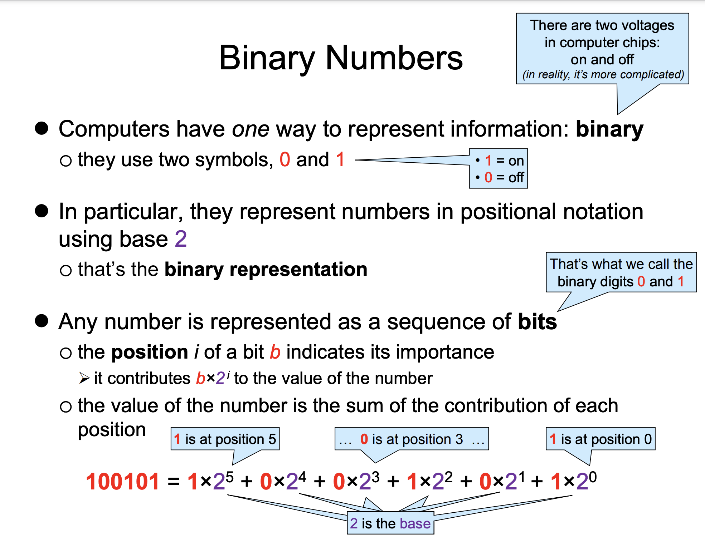

# Lecture 1 Primitive Data Types and Control
## Java History

•Java was originally developed by [James Gosling](https://en.wikipedia.org/wiki/James_Gosling) at [Sun Microsystems](https://en.wikipedia.org/wiki/Sun_Microsystems). It was released in May 1995 as a core component of Sun's [Java platform](https://en.wikipedia.org/wiki/Java_(software_platform)). The original and [reference implementation](https://en.wikipedia.org/wiki/Reference_implementation) Java [compilers](https://en.wikipedia.org/wiki/Compiler), virtual machines, and [class libraries](https://en.wikipedia.org/wiki/Library_(computing)) were originally released by Sun.
• [Oracle](https://en.wikipedia.org/wiki/Oracle_Corporation) offers its own [HotSpot](https://en.wikipedia.org/wiki/HotSpot_(virtual_machine)) Java Virtual Machine, however the official [reference implementation](https://en.wikipedia.org/wiki/Reference_implementation) is the [OpenJDK](https://en.wikipedia.org/wiki/OpenJDK) JVM which is free open-source software and used by most developers and is the default JVM for almost all Linux distributions.
## Hello World

```Java
public class HelloWorld {
  public static void main(String[] args) {
    System.out.println("Hello World");
  }
}
```

Function/Method *main* is the entrance of the program, now you should type all things in *main* method.
## Variables

[Integer: 整数](https://www.cs.cmu.edu/~15122/handouts/slides/review/02-ints.pdf)
In our life, we use decimal numbers, but in computers, we use binary numbers




All integer numbers in Java are represented as **int**.  **Have a try!**

```Java
public class HelloWorld {
  public static void main(String[] args) {
    int a = 3;  //Decimal
		int b = 0b100101; //Binary
		int c = 0xC0FFEE; //Hexadecimal
  }
}
```

In real life, we all know the set of natural number is infinite, but it's not in computer since we don't have unlimited memory to use.


Let's play with this overflow !

```Java
public class HelloWorld {
  public static void main(String[] args) {
		System.out.println(Integer.MAX_VALUE);
		System.out.println(Integer.MAX_VALUE + 1);
		System.out.println(Integer.MIN_VALUE);
		System.out.println(Integer.MIN_VALUE - 1);
  }
}
```

Not enough, this is very dangerous, we need to be careful about that.
You can't do these operations below!

```Java
public class HelloWorld {
  public static void main(String[] args) {
		System.out.println(3 / 0);
		System.out.println(Integer.MIN_VALUE / (-1));
  }
}
```

double 浮点数 小数

```Java
public class HelloWorld {
  public static void main(String[] args) {
		double a = 0.3;
		System.out.println(a);
		//精度问题
		double a = 0.2 + 0.1;
		double b = 0.3;
		System.out.println(a == b);
  }
}
```

boolean 布尔值 two states, 1 is true, 0 is false

Three operations, and && ; or || ; not !

```Java
public class HelloWorld {
  public static void main(String[] args) {
		boolean a = true;
		boolean b = false;
		System.out.println(a);
		//We also have operations for it!
		System.out.println(!a);
		System.out.println(a && b);
		System.out.println(a || b);
  }
}
```


de Morgan's Law !!

```
!(a && b) == (!a || !b)
!(a || b) == (!a && !b)
```

String 字符串

Notice! When we declare the variable in String type, S is capital unlike double, int or boolean. Why? We will explain it further in later lectures.

```Java
public class HelloWorld {
  public static void main(String[] args) {
		String a = "Hello, world";
		System.out.print(a); 
	}
}
```

## If...Else

```
if(boolean) {
	code block will be excuted if boolean is true
}
```

```Java
public class HelloWorld {
  public static void main(String[] args) {
		int x = 30; 
		if(x < 20){ 
			System.out.print("This is IF"); 
		}
		else{ 
			System.out.print("This is ELSE"); 
		}
  }
}
```

```Java
public class HelloWorld {
  public static void main(String[] args) {
		int x = 30; 
		if(x < 20){ 
			System.out.print("Number is less than 20"); 
		}
		else if(x == 20) {
			System.out.print("Number is 20"); 
		}
		else{ 
			System.out.print("Number is greater than 20"); 
		}
  }
}
```

```Java
public class HelloWorld {
  public static void main(String[] args) {
		boolean a = ...;
		boolean b = ...;
		if(a) {
			if(b) {
				//How can we modify it but the same logic
			}
		}
  }
}
```

```Java
public class HelloWorld {
  public static void main(String[] args) {
		switch(expression) { 
			case value: 
				//Code Block
				break; 
			case value: 
				//Code Block
				break; 
			default: 
		}
  }
  // Try to delete breaks here!!
}
```

## Loop

```Java
public class HelloWorld {
  public static void main(String[] args) {
		while(boolean loop guard) {
		//loop body
		}

		int x = 10; 
		while( x < 20 ) { 
			System.out.println("value of x : " + x ); 
			x++; 
		}

		for(init; loop guard; update) {
			//loop body
		}

		for(int x = 10; x < 20; x++) {
			System.out.println("value of x : " + x ); 
		}


		//Try our break and continue
		for(int x = 10; x < 20; x++) {
			if(x == 15) break;
			System.out.println("value of x : " + x ); 
		}

		for(int x = 10; x < 20; x++) {
			if(x == 15) continue;
			System.out.println("value of x : " + x ); 
		}
	}
}
```

## Array

Array is a collection of a specific type of elements!
You should notice, it could only contain one type of elements unlike list in Python.

```Java
public class HelloWorld {
  public static void main(String[] args) {
		dataType[] nameOfArr = new dataType[arrSize];
		int[] studentsAges = new int[10];
		int[] studenesAges = {10, 20, 40};

		//it has an innate field called length
		int arrLen = studentsAges.length;
		//How to traverse the array: Two methods

		//Use common loops for/while
		for(int i = 0; i < arrLen; i++) {
			studentsAges[i] = ...;
		}

		//For-Each Loop
		for(int age : studentAges) {
			System.out.println("Student age: ", age); 
		}
	}
}
```

In this situation, you would find that we could only read while using the second method. However, when we get further, you can also modify the elements in the array with it.

