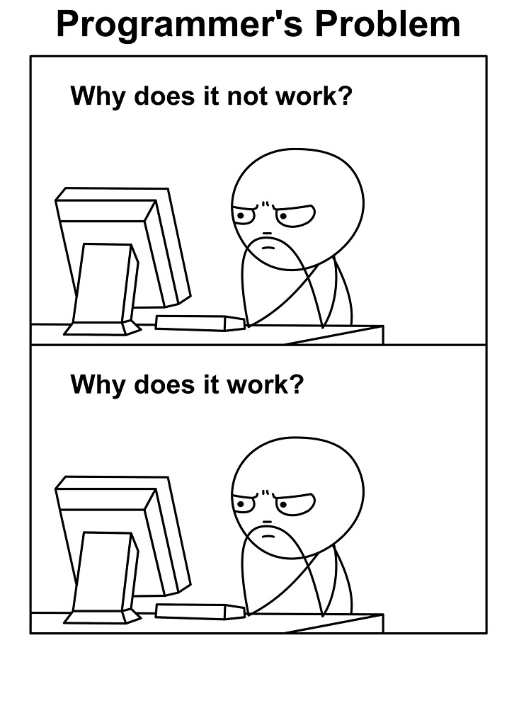

# Lesson2 Objects and Classes

**Reminder: Please review the last lesson first!**



Now! Get ready to learn the most important class!

## Introduction

Before talking about the computer, let's think about the real world. Semantically, the word "object" can be referred to anything around the world, which is that everything could be an "object". For example, I would say *Tom* is an object, and *your family's car* is also an object.

How about the class? We might think about the word "classify" or "classification", so the "class" is very same as the category. Use example above, *Tom* is an object, and the class of *Tom* is apparently *person*.

Thus, there is an old saying in computer science, "Class is the abstraction of objects".

## Class in Java

Let's turn back to the computer science. For example, if I want to represent a car in the program, what things should I do?
First, let's define the class *Car*!

```Java
public class Car {
  //Reminder: Captitalize the name of your class!! 👆
}
```

Besides, we all know for a car, it must have some related parameters, such as **brand**, **price**, **color**, and **power**.

Notice that we are representing *car*, but not any specific car in the world since we are designing a **class(abstraction)**. Then let's write these **attributes**, or the properties of an element, in our class.

```Java
public class Car {
  int price;
  String brand;
  String color;
  double power;
}
```

It's not enough! For a car, we can drive it or blow the whistle, which are the actions of a car. How can we define the actions of a class. The answer is **function**, or **method**. Let's see how can we write a method in Java.

```Java
public class Car {
  int price;
  String brand;
  String color;
  double power;

  //To define the function, you must follow this format
  T name(V v, S s) {
    //  T: type of value you will return
    //  V, S: type of parameter
    //  v, s name of parameter
  }

  //For example, we know every car has different whistles,
  //so we can let our user customize the whistle by passing different whistles.
  void blowWhistle(String whistleSound) {
    System.out.println(whistleSound);
  }
  //Since we have no value to return, we write void here to represent None

  //Or we can simply return some of our attributes
  int getPrice() {
    return price;
  }
}
```

Now, we almost reach the destination, but there is a serious problem. The purpose of defining a class is to help us build/initialize objects, but there isn't any place where we can assign values to the **attributes** we wrote in the class. Hence, we need a tool called **constructor** to help us initialize objects.

```Java
public class Car {
  int price;
  String brand;
  String color;
  double power;

  //To define a constructor, it's very similar as method.
  Car(int p, String b, String c, double po) {
    price = p;
    brand = b;
    color = c;
    power = po;
  }

  void blowWhistle(String whistleSound) {
    System.out.println(whistleSound);
  }

  int getPrice() {
    return price;
  }
}
```
