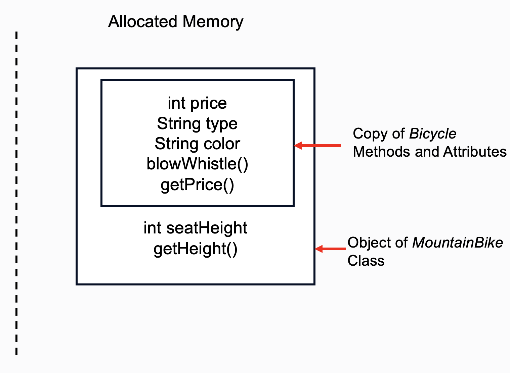
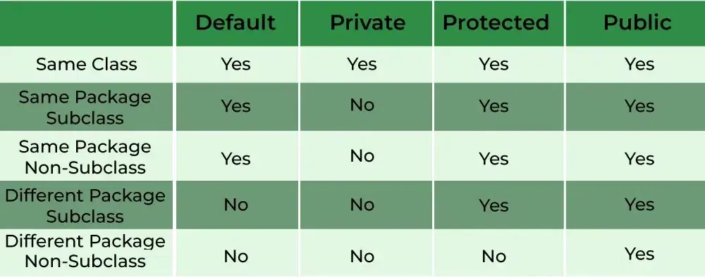

# Lesson3 Inheritance, Interface, and more

**Reminder: Please review the last lesson first!**

**Notice:** *Italicized* word is class & **Bold** word is method


Write down your comments and update your documentation in time. Otherwise....

## Inheritance

Do not make the wheels repeatedly! It's very important for us to use and extend the programs we made before. This is why inheritance is necessary for us to learn.

**Important Terminologies You Need To Know**

+ **Super Class/Parent Class**: The class whose features are inherited is known as a superclass(or a base class or a parent class).
+ **Sub Class/Child Class**: The class that inherits the other class is known as a subclass(or a derived class, extended class, or child class). The subclass can add its own fields and methods in addition to the superclass fields and methods.

For example, *Bicycle* is a class, and *MountainBicycle* is obviously a class that derives from *Bicycle*.

Here, we call *Bicycle* the superclass, and *MountainBicycle* the subclass!

```java
public class Bicycle {
  //Why is there no "private" modifier? We will reveal the reason later.
  int price;
  String type;
  String color;

  public Bicycle(int price, String type, String color) {
    this.price = price;
    this.type = type;
    this.color = color;
  }

  public Bicycle() {
    this(100, "Default", "Red");
  }

  public void blowWhistle() {
    System.out.println("Ding Ding "+type+" is here!");
  }

  public int getPrice() {
    return price;
  }
}
```

In Java, we use keyword **extends** to inherit a class.

```java
public class MountainBicycle extends Bicycle{
  int seatHeight;

  public MountainBicycle(int height) {
    seatHeight = height;
  }

  public int getHeight() {
    return seatHeight;
  }
}
```
**Do You Remember:** There are two memory space for computers, **Local Memory** and **Allocated Memory**. Let's see how the computer's memory changes when we instantiate a class that inherits another class.



As you can see, when we instantiate a class that inherits another class. It will first copy all methods and atrributes/fields of the superclass, which you can consider this copy as **an object of the superclass embedded in the object of the subclass**. Then the object of subclass is instantiated. With these information, we can speculate two things:

1. The **constructor** of the superclass must be called in order to create the **copy** of the object of superclass.
2. With the copy of all methods and fields in superclass, we can use them with the mere **object of subclass**.

Hence, with the speculation, the correct format of the subclass should be like this:

```java
public class Subclass extends Superclass {
  //Fields

  public Subclass(args...) {
    super(args...);
    //Write the rest of the constructor as you learned before
  }

  //Methods
}
```

**Notice:** here, we use super() to represent the constructor of our superclass. However, why is there no super() in the *MountainBike* class example? That's because JVM will automatically call the constructor with no arguments, which is **Bicycle()** at the **very beginning** of the constructor of class *MountainBike*.

Hence, it's similar as:

```java
public class MountainBicycle extends Bicycle{
  int seatHeight;

  public MountainBicycle(int height) {
    super();
    seatHeight = height;
  }

  public int getHeight() {
    return seatHeight;
  }
}
```

Also, you can choose what constructor you want to call while writing your constructor, like:

```java
public class MountainBicycle extends Bicycle{
  ...

  public MountainBicycle(int price, String type, String color, int height) {
    super(price, type, color);
    seatHeight = height;
  }
  ...
}
```

--------
Now, let's try to instantiate the object of subclass and see how we can operate.

```java
public class MountainBicycle extends Bicycle{
  ...
  public static void main(String[] args) {
    MountainBicycle m1 = new MountainBicycle(10);
    System.out.println("Color: " + m1.color);
    System.out.println("Type: " + m1.type);
    System.out.println("Seat height: " + m1.seatHeight);
    System.out.println("Price: " + m1.getPrice());
    System.out.println("Seat height: " + m1.getHeight());

    //Also, you can use the declare the object as superclass
    //Then, instantiate it with constructor of subclass
    Bicycle m1 = new MountainBicycle(10);

    //However, if you try the inverse, compiler will report an error
    MountainBicycle m2 = new Bicycle(10);
  }
}
```

The output is:

```
Color: Red
Type: Default
Seat height: 10
Price: 100
Seat height: 10
```

**Notice that:** You can declare the type of superclass, and instantiate an object by calling the constructor of the subclass. 

**However:** You can only use the method and fields in the superclass, because when you are calling the functions in the subclass, the compiler would report an error that the method is undefined for the superclass. 

**Test Yourself**

```java
public class SuperClass {
  public void a() {
    System.out.println("A in Superclass");
    b();
  }

  public void b() {
    System.out.println("B in SuperClass");
    c();
  }

  public void c() {
    System.out.println("C in SuperClass");
  }

  public static void main(String[] args) {
    SuperClass obj = new SuperClass();
    obj.a();
  }
}
```

The output is simple, which is:

```
A in Superclass
B in SuperClass
C in SuperClass
```

```java
public class SubClass extends SuperClass{
  @Override
  public void a() {
    System.out.println("A in SubClass");
    b();
  }

  @Override
  public void c() {
    System.out.println("C in SubClass");
  }

  public static void main(String[] args) {
    SuperClass obj2 = new SubClass();
    obj2.a();
  }

}
```

The output might surprise you, it is:

```
A in SubClass
B in SuperClass
C in SubClass
```

**Figure it out by yourself!**

----

You can access the fields and methods of superclass directly. However, sometimes we want to **change** some of the **methods/fields** of superclass in the **subclass**. How can we achieve that?

+ "Change" the method of superclass

  More precisely, we call the change of the method as "override". You can comprehend "override" as that you originally have a method, and then you write a new method to cover it up, but it still exists. 
  
  For example, if you want to override **getPrice()** method of class *Bicycle* in the class *MountainBicycle*.

  ```java
  public class MountainBicycle extends Bicycle{
    ...

    @Override
    public int getPrice() {
      return 2 * super.getPrice();
    }
  }
  ```

  Try main method above again, the output should be:
  ```
  Color: Red
  Type: Default
  Seat height: 10
  Price: 200
  Seat height: 10
  ```

  Price is doubled compared with the last output. Because when we call **m1.getPrice()** at first, we are calling the method **getPrice()** of class ***Bike***. 
  When we call **m1.getPrice()** after overriding, we are calling the method **getPrice()** of class ***MountainBike***
  
  Supplemet Information:
  
  + @Override is an [annotation](https://www.geeksforgeeks.org/annotations-in-java/), which you can interpret it as a label tagged on a method. 

  + Keyword **super** is similar as keyword **this**. **this** represents current object, so **super** represents the copy of the object of superclass. In this situation, when we call **super.getPrice()**, it's acatually the method **getPrice()** of class ***Bike***
  
  **Takeaway:** 
  + You should write @Override above **every overriden** method 
  + Use keyword **super** and keyword **this** to distinguish fields and methods of superclass and subclass **if they have same names**

+ Change the fields of superclass

  We can directly change any fields of superclass in the subclass:

  ```java
  public class MountainBicycle extends Bicycle{
    ...
    public void changePrice() {
      price *= 3;
    }

    public static void main(String[] args) {
      MountainBicycle m1 = new MountainBicycle(10);
      System.out.println("Price before change: " + m1.price);
      m1.changePrice();
      System.out.println("Price after change: " + m1.price);
    }
  }
  ```

  Ouput is:

  ```
  Price before change: 100
  Price after change: 300
  ```

  This is easy to understand, ***however***

  First review the example codes we provided, you would find that there is no modifier "private" before atrributes/fields. **Why?**

  Actually, there are multiple modifiers in Java that enable us to have different accessibility of methods/fields. 

  

  That's why we didn't add modifier "private" in front of attributes, since it will prevent us from accessing fields of superclass in the subclass. 
  
  Instead, the completed version of class *Bicycle* should be:

  ```java
  public class Bicycle {
    //Why is there no modifier "private"? Here is the reason!.
    protected int price;
    protected String type;
    protected String color;

    public Bicycle(int price, String type, String color) {
      this.price = price;
      this.type = type;
      this.color = color;
    }

    public Bicycle() {
      this(100, "Default", "Red");
    }

    public void blowWhistle() {
      System.out.println("Ding Ding "+type+" is here!");
    }

    public int getPrice() {
      return price;
    }
  }
  ```

  Supplement Information:

  + Modifier "Default" in the table represents there is no modifier in front of attributes
  + The term "package" of Java is **important**. In Lab1 classes we wrote, there is a declaration of package above the declaration of class. In Java, the package name is as same as the name of your directory you store the **.java** file. By default, in our project, we will have directory sturcure like **src/main/java/com/team5449**. If you write a class named FlywheelsPID in directory **com/team5449/subsystems/flywheel**, the package name should be like following. 

  ```java
  package lab1;
  public class ScoreBoard {
    ...
  }

  package com.team5449.frc2024.subsystems.flywheel;
  public class FlywheelsPID extends PIDSubsystem {
    ...
  }
  ```

  **Takeaway:**
  + Be careful about the access modifier
  + Ensure that you have package declaration in every **.java** file. And you can access the file in the **same directory** without importing it!

## Interface

### Introduction to Interface
In class, we not only declare our methods (Define the return value type, name, and arguments of a method), but also provide the implementation of methods (The code block following the declaration)

```java
public int add(int a, int b) //Declaration
{                            //Implementation
  return a + b;              //Implementation
}                            //Implementation
```

If I only write the declaration of a method without implementation, we call this method **Abstract Method**.

```java
public int add(int a, int b); //Abstract Method
```

With the knowledge of abstract method, it's time to introduce interface.

Suppose I provide you with a series of helper funcitons, like POW, a function that calculates a^b.

```java
//return the value of a^b
int POW(int a, int b);
```
When you want to call this function, you shouldn't care about the implementation of this function. Because you should only care about the format of inputs and outputs of the method to use it. There could be multiple ways to implement this method, but users only need to know how to use it.

This is why we have to use interface. We use interface to only provide function itself, and implementation or utility of the method could be **changed** at any time.

**Definition** of interface in Java:

An interface is a completely "abstract class" that is used to group related abstract methods with empty bodies.

--------

### The Usage of Interface

Take the example above, we would have a interface *Bike*, containing different abstract methods

```java
public interface Bicycle {
  void blowWhistle(String whistle);
  int getPrice();
  String getType();
}
```

How can we add implementations to these abstract methods? We need to create a new class and use keyword **implements** to implement these methods.

```java
public class MountainBicycle implements Bicycle {
  
}
```
After adding declaring the class, we would see the error reported by the compiler.
```
The type MountainBicycle must implement the inherited abstract method Bicycle.getPrice()
```
**Remember:** Implement all methods of interface in the class!

You can implement these three methods as you want as long as they have same declarations as those in the interface. And you can define constructors, methods, and fields as normal class.

```java
public class MountainBicycle implements Bicycle {
  private int price;
  private int seatHeight;
  private String type = "MountainBicycle";
  
  public MountainBicycle(int price, int seatHeight) {
    this.price = price;
    this.seatHeight = seatHeight;
  }

  @Override
  public void blowWhistle(String whistle) {
    System.out.println(whistle + type + " is here!");
  }

  @Override
  public int getPrice() {
    return price;
  }

  @Override
  public String getType() {
    return type;
  }

  public int getSeatHeight() {
    return seatHeight;
  }
}
```

OR I want to implement a class called *RacingBike*

```java
public class RacingBicycle implements Bicycle {
  private int price;
  private int maxSpeed;
  private String type = "RacingBicycle";
  
  public RacingBicycle(int price, int maxSpeed) {
    this.price = price;
    this.maxSpeed = maxSpeed;
  }

  @Override
  public void blowWhistle(String whistle) {
    System.out.println(whistle + type + " is here!");
  }

  @Override
  public int getPrice() {
    return price;
  }

  @Override
  public String getType() {
    return type;
  }

  public int getMaxSpeed() {
    return maxSpeed;
  }
}
```

In a new class called BicycleTest.java, we can test it.

```java
public class BicycleTest {
  public static void main(String[] args) {
    Bicycle r1 = new RacingBicycle(200, 900);
    RacingBicycle r2 = new RacingBicycle(200, 900);
    r1.blowWhistle("Ding Ding"); //No Problem
    r2.blowWhistle("Ding Ding");//No Problem
    r1.getMaxSpeed();//!!  The method getMaxSpeed() is undefined for the type Bicycle
    r2.getMaxSpeed();//No problem
  }
}
```

We can declare the type as Bicycle and instantiate the object with the constructor of the class that implements the interface. However, you would find that you could only call the functions the interface has. Here, it's illegal to call function **r1.getMaxSpeed()** since the compiler detects that method getMaxSpeed() is undefined for type *Bicycle*.

----

### Pass the interface as a parameter

We can also utilize the property above while passing the interface as a parameter!

Now, I have a factory called *BikeFactory*, which will be a class. It will definitely use the methods such as **getPrice()**, **getType()**, and **blowWhistle(String whistle)**

```java
public class BikeFactory {
  private ArrayList<Bicycle> bikes = new ArrayList<>();

  public void addBicycle(Bicycle bike) { //Look here
    bikes.add(bike);
  }

  public ArrayList<Integer> getBikePricesArray() {
    ArrayList<Integer> bikePrices = new ArrayList<>();
    for(Bicycle bike : bikes) {
      bikePrices.add(bike.getPrice()); //Look here
    }
    return bikePrices;
  }

  public List<Integer> getBikePricesList() {
    return bikes.stream()
      .mapToInt(Bicycle::getPrice) //Look here
      .boxed().collect(Collectors.toList());
  }

  public static void main(String[] args) {
    BikeFactory bf = new BikeFactory();
    bf.addBicycle(new MountainBicycle(100, 70));
    bf.addBicycle(new RacingBicycle(300, 70));
    ArrayList<Integer> bikePrices = bf.getBikePricesArray();

    for(int bikePrice : bikePrices) {
      System.out.println(bikePrice);
    }
  }
}
```

The output is surely:

```
100
300
```
Since these two classes are the implementations of interface ***Bicycle***, we can pass class ***MountainBicycle*** and ***RacingBicycle*** when the argument of method requires ***Bicycle***.

-----

### The benefits of using interface

1. Multuple Inheritance. In Java, we're only allowed to inherit one class, but a class can implement multiple interfaces. With the property, we can achieve multiple inheritance.

2. [Loose Coupling](https://www.geeksforgeeks.org/coupling-in-java/)

3. Advanced Usage of Interface, Lambda, which is a way to utilize functional programming


-----

### Lambda: Functional Programming

Suppose we have a interface that only has one abstract method

```java
public interface Message {
  void send();
}
```

I want you to output "This is a SMS messgage" while calling the function send(), how would you achieve that traditionally?

We would have a new class implementing interface *Message*, and then override the method send()

```java
public class SMSMessage {
  @Override
  public void send() {
    System.out.println("This is a SMS messgage");
  }
}
```

Let's test this way:

```java
public class MessageTest {
  public static void main(String[] args) {
    Message m = new SMSMessage();
    m.send();
  }
}
```

The output is:

```
This is a SMS messgage
```

However, this is too complicated for us, since we need to write a new class every time when we want to change the implementation of abstract method. For example, if we want to output "This is a Ins messgage", we have to create a new class named *InsMessage*.

Now, let's introduce lambda, which enables us to implement the abstract method without relying on the class.

```java
public class MessageTest {
  public static void main(String[] args) {
    Message m = () -> {System.out.println("This is a SMS messgage");};
    m.send();
  }
}
```

The output is also:

```
This is a SMS messgage
```

**You might wonder**: What is () -> {} ??

Let's recall the format of function

```java
modifier returnValType methodName(args...) {
  //Implementation of the method
}
```

Hence, we put arguments in (), and the implementation of the method is written in {} .

**Notice:** The return value type and arguments of lambda expression should be corresponding with these of abstract method we declared in the interface.

Let's try another example

```java
public interface Addition {
  int add(int a, int b);
}
```

Easy peasy, we can implement it directly,

```java
public class MathTest {
  public static void main(String[] args) {
    Addition addition1 = (a, b) -> {return a + b;};
    System.out.println(addition1.add(3, 4));

    Addition addition2 = (add1, add2) -> {return add1 * 1 + add2 * 1;};
    System.out.println(addition2.add(3, 4));
  }
}
```

**Attention:** Lambda Expression is available if and only if the interface has one abstract method.

-----

Also, lambda expression can also be passed as a parameter. After all, it's the definition of a interface, since interface can be passes, why not lambda?

Usually, we will use Supplier and Consumer interface to pass the values. Those are interfaces provided by the Java official.

When we want to implement TankDrive, we can define it as following:

```java
public class TankDrive extends SubsystemBase {
  private final DoubleSupplier forwardSupplier;
  private final DoubleSupplier rotateSupplier;

  public TanDrive(DoubleSupplier forward, DoubleSupplier rotate) {
    forwardSupplier = forward;
    rotateSupplier = rotate;
  }
  ...
  public void drive() {
    double x = forwardSupplier.getAsDouble();
    double yaw = rotateSupplier,getAsDouble();
    double leftSpeed = x - yaw;
    double rightSpeed = x + yaw;
    ...
  }

  public void drive(double x, double yaw) {
    double leftSpeed = x - yaw;
    double rightSpeed = x + yaw;
    ...
  }

  @Override
  public void periodic() {
    drive();
  }
}
```

As you can see, we pass the two suppliers while constructing the object. And the lambda expression is written in the constructor to implement the **getAsDouble()** method of interface *DoubleSupplier*.

```java
public class Robot extends LoggedRobot {
  private TankDrive tankDrive;
  private final XboxController driverController;
  ...
  public Robot() {
    tankDrive = new TankDrive(() -> -driverController.getLeftY(), () -> driverController.getRightX());
  }

  @Override
  public void teleopPeriodic() {
    //tankDrive.drive(-driverController.getLeftY(), driverController.getRightX());
  }
}
```

The benefit of using *DoubleSupplier* is that we could periodically call **drive()** of the chassis in the subsystem class. If we merely use double, we still need to periodically call **drive(double x, double yaw)** in the **teleopPeriodic()** of class *Robot*.

There are more usage of lambda expressions in FRC, and you will find you can materialize your ideas with shorter lines of codes by using functional programming!

## More
The introduction to basics of Java ends here, but there is a lot you need to learn by yourself!

Click each link and scrutinize resources provided!

+ **The Most Important One** [Enum Class in Java](https://www.youtube.com/watch?v=wq9SJb8VeyM)

  You will learn the most useful tool in robot programming: State machine. Enum class is the basic to implement it.

+ [Excepiton Handling](https://www.geeksforgeeks.org/exceptions-in-java/)

  When there is a Runtime Error raised, you can absolutely let your OI/ACM code stop. However, it will be fatal in robots and industrial programs, since these programs shouldn't be stopped at any time. Learn exception handling to catch these Runtime Errors and process them properly. And you are even able to customize the error by yourself.

+ [Inner Class in Java](https://www.geeksforgeeks.org/inner-class-java/)

  With Inner class, we can make our codes clean and more readable

+ [Static Code Blocks](https://www.geeksforgeeks.org/static-blocks-in-java/)

  We use it to initialize all constants at the very beginning of program.

+ [Interface in Java 8+](https://www.geeksforgeeks.org/interfaces-in-java/)

  There are updates of interface after Java 8, and we sometimes use these properties. Check them out.

+ [Annotation](https://www.geeksforgeeks.org/annotations-in-java/)

  Magic of Java, you will use it while logging your robot


**Extensions: really hard but useful in your career or future study:**

+ [Multithreading in Java](https://www.geeksforgeeks.org/java-multithreading-tutorial/?ref=shm)

+ [Reflection in Java](https://www.geeksforgeeks.org/reflection-in-java/)
